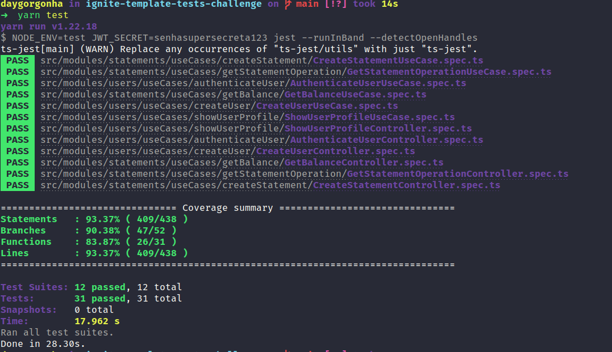

<h1 align="center">🚀 Desafio Ignite - Trilha NodeJS</h1>
<p align="center">
  Desafio Principal 01 - Testes unitários
  Desafio Complementar 02 - Testes de integração
  <br>
</p>
<h1 align="center">:pushpin: Sobre o desafio</h1>
No desafio 01, foi criado os testes unitários para uma aplicação e no desafio 02 foi criado os testes de integração já pronta usando e aplicando o que foi aprendido até agora sobre os testes.

<h1 align="center">:pushpin: Algumas das tecnologias utilizadas</h1>
<p align="center">
  Abaixo estão algumas das tecnologias utilizadas durante o desenvolvimento do backend. Ainda foi visado: Organizar o diretório da nossa aplicação de forma concisa, limpa e eficiente. Escrever código limpo visando reutilização e eficiência e criar testes unitários de integração.
</p>
<br/>
<p align="center">
  
  
  
  
  
</p>
<p align="left">

### :keyboard: Instalação e Execução dos Testes deste Projeto

- Clone este repositório

```
> git clone https://github.com/daygorgonha/ignite-template-tests-challenge
```

- Navegue até o diretório principal do projeto

```
> cd ignite-template-tests-challenge
```

- Instale as dependências com o Yarn

```
yarn
```

- Rode a suite de testes

```
yarn test
```

</p>
<br/>
<p align="center">
  
</p>

## :memo: Licença

Esse projeto está sob a licença MIT. Veja o arquivo [LICENSE](https://github.com/git/git-scm.com/blob/master/MIT-LICENSE.txt) para mais detalhes.

---

Feito com 💜 by <a href="https://www.linkedin.com/in/dayanegorgonha/">Dayane Gorgonha</a>
